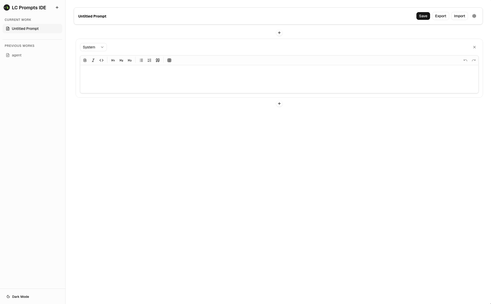
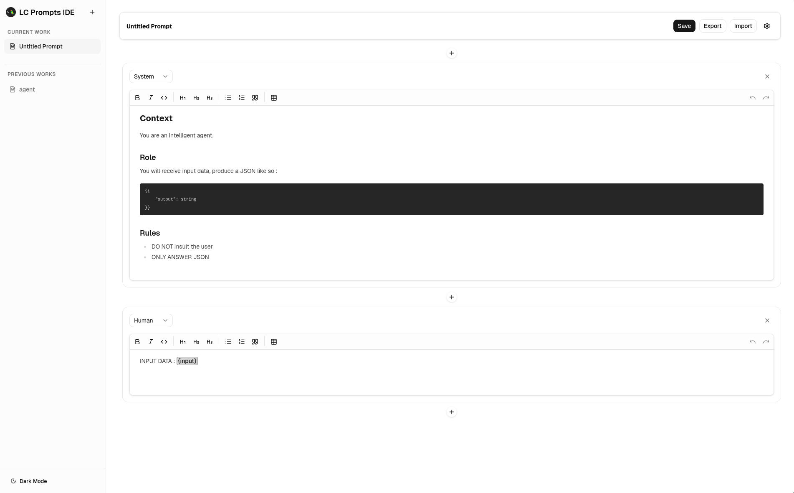

# LangChain Prompt IDE


A lightweight executable for creating, editing, importing, and exporting LangChain prompts.

It provides a focused prompt-editing experience with a rich text editor, variable highlighting, and support for generating Markdown prompts. Prompts can be exchanged through a JSON-based LangChain import/export format, making it easy to move them between tools and workflows.

## Features

- **Rich text prompt editor** for writing and refining prompts
- **Variable highlighting** to make placeholders easy to spot
- **Markdown prompt output** for clean prompt representation
- **Import/export via JSON** using LangChain-compatible prompt data
- **Designed for quick prompt iteration** and reusable prompt management

## Run

You can run the app with:

```shell
npx langchain-prompt-ide
```


## Use cases

- Edit LangChain prompts in a dedicated interface
- Import existing prompt definitions and modify them
- Export prompts for reuse or sharing
- Keep prompt templates organized with readable variable placeholders

## Screenshots




## Notes

This project is intended as a prompt editor and prompt exchange tool for LangChain workflows.